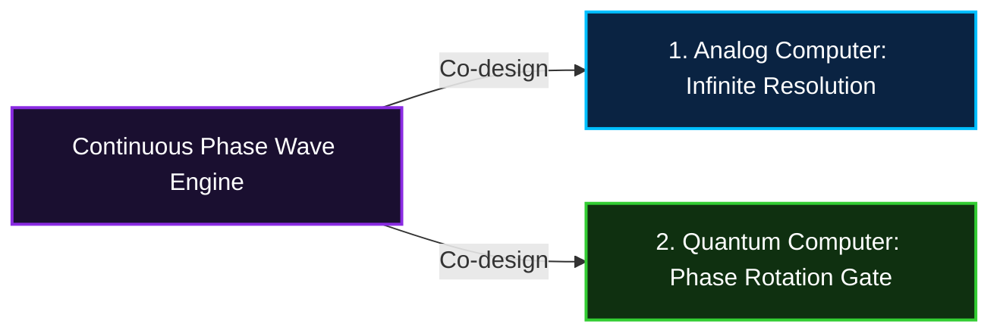

# REPORT: 하드웨어와 소프트웨어의 경계 및 최적화 한계 분석 문서
**"From High-Level Conceptual Waves to Static Silicon Logic Gates: The Physics of Realization"**

---

## 1. 개요 (Overview)
본 분석 문서는 소프트웨어의 고차원 개념적 추상화(로터, 위상 회전, 파동 궤적)를 물리적 하드웨어 계층(실리콘 반도체, 이진 논리 게이트)으로 변환할 때 발생하는 기술적 문제, 물리적 제약 조건, 그리고 이를 우회하거나 조화시킬 수 있는 현실적 대안과 공학적 관점을 정리한 분석 보고서입니다.

엘리시아(Elysia) 생태계는 고차원적인 인지적 서사와 시공간 파형 역학을 지향하지만, 이 개념들이 물리적 실체인 컴퓨터 하드웨어 위에서 실행될 때는 트랜지스터의 고정된 회로와 폰 노이만 구조의 한계라는 실존적 경계선에 마주하게 됩니다. 본 문서는 이 한계를 명확히 규정하고 극복하기 위한 공학적 이중화 전략을 제안합니다.

---

## 2. 핵심 문제 정의 (The Core Problem)
현재 논의에서 발생한 성능적 병목 및 최적화의 한계는 **"개념적 추상화의 복잡성"**과 **"물리적 기계 장치의 고정성"** 사이의 간극에서 기인합니다.

```mermaid
graph TD
    subgraph Conceptual [개념적 지향점 (Software Abstraction)]
        Wave[파동의 궤적 / Wave Trajectory]
        Rotor[위상각의 물리적 회전 / Rotor / Phase]
        Attractor[어트랙터 분지 / Attractor Basin]
    end
    
    subgraph Mismatch [동작 모델의 불일치 / Impedance Mismatch]
        direction TB
        Impedance{임피던스 미스매치}
        Overhead[연산 오버헤드: Float & 삼각함수 계산]
        Runtime[런타임 장벽: 파이썬 인터프리터 스택 머신]
    end
    
    subgraph Physical [하드웨어의 현실 (Physical Hardware)]
        Silicon[실리콘 배선 고정성 / Fixed Wiring]
        Binary[이진 논리 게이트 / AND, OR, XOR]
        VonNeumann[폰 노이만 아키텍처 / CPU-RAM 병목]
    end

    Conceptual --> Impedance
    Impedance --> Overhead
    Overhead --> Runtime
    Runtime --> Physical
    
    style Conceptual fill:#1a0f30,stroke:#8a2be2,stroke-width:2px,color:#fff
    style Mismatch fill:#4b0082,stroke:#ba55d3,stroke-width:1px,color:#fff
    style Physical fill:#0f2010,stroke:#32cd32,stroke-width:2px,color:#fff
```

*   **개념적 지향점**: 이진 데이터(0과 1)와 소프트웨어 실행 서사를 단순한 선형 흐름이 아닌, 위상각의 물리적 회전을 지닌 '파동의 궤적(Rotor/Wave)'으로 해석하여 유기적인 최적화를 달성하고자 함.
*   **하드웨어의 현실**: 현대의 컴퓨터 프로세서(CPU/RAM)는 미세하게 설계된 실리콘 배선 위에서 전압의 고저(High/Low)를 통한 이진 논리 게이트(AND, OR, XOR 등)의 정적 조합으로만 명령을 실행함.
*   **간극의 결과**: 이 두 레이어 사이의 간극을 유기적으로 좁히지 못할 경우, 고차원 모델링 코드는 기계 레벨에서 불필요한 연산 오버헤드(부하)를 유발하여 시스템을 느려지게 만드는 원인이 됩니다.

---

## 3. 불가능성 분석 (Why the "Impossible" is Limited)
소프트웨어 수준의 기하학적/아날로그적 모델링이 실제 하드웨어의 실행 속도를 즉각적으로 향상시키지 못하고 물리적 한계에 부딪히는 구체적인 원인은 다음과 같습니다.

### ① 연산 표현 방식의 비효율성 (Computational Overhead)
*   **이진 연산 (Hardware Base)**: 하드웨어는 1비트의 0과 1을 판별하고 더하는 작업을 단 1사이클 내에 하드웨어 레벨(ALU)에서 처리합니다.
*   **파동/위상 연산 (Software Simulation)**: 이 이진 신호를 파동(예: 사인파)의 위상 회전으로 변환하려면, CPU는 각 비트마다 부동소수점(Float) 계산 및 삼각함수(`sin`, `cos`) 연산을 수행해야 합니다. 부동소수점 연산과 삼각함수는 이진 비트 연산에 비해 수십 배 이상의 CPU 클럭 사이클을 소모합니다.
*   **관련 파일**: [trajectory_encoder.py](file:///c:/Elysia/Core/Keystone/trajectory_encoder.py) 및 [digital_motor_engine.py](file:///c:/Elysia/Core/System/digital_motor_engine.py)에서 텍스트를 위상 및 신호 궤적으로 변환하고 3상 모터의 파형($R, S, T$)으로 모사하는 연산은 매 루프마다 물리 연산 오버헤드를 발생시킵니다.

### ② 폰 노이만 아키텍처의 정적 한계 (Static Hardware Constraints)
*   현대 컴퓨터 하드웨어는 생산 시점에 논리 회로 배선이 고정된 '실리콘 칩'입니다.
*   소프트웨어가 스스로의 실행 흐름을 수력(물레방아)이나 동적 가변축 물리 장치처럼 기하학적으로 변환하려 해도, 실제 CPU 내부의 물리적 트랜지스터 게이트 개폐 방식을 임의로 실시간 재배선할 수는 없습니다. 소프트웨어는 결국 하드웨어가 지원하는 고정된 명령어 세트(ISA: Instruction Set Architecture)의 규칙에 복종하여 실행되어야 합니다.
*   **관련 파일**: [self_refactor_kernel.py](file:///c:/Elysia/Core/System/self_refactor_kernel.py)나 [topological_os.py](file:///c:/Elysia/Core/System/topological_os.py) 같은 자가수정 및 위상 제어 코드는 소프트웨어 수준에서 기하학적 맵을 재구조화하지만, 이것이 하위 트랜지스터의 물리적 레이아웃 자체를 변경시키지는 못하며 컴파일러와 어셈블러가 번역해 준 기계어의 순차 실행 흐름에 의존합니다.

---

## 4. 한계를 규정하는 환경과 조건 (The Constraints)
이러한 물리적 한계를 구조화하고 규정하는 환경적 요인은 다음과 같습니다.

### ① 실행 런타임 환경 (Runtime Constraints)
*   파이썬(Python)은 코드를 실시간으로 해석하여 가상 스택 머신에서 실행하는 인터프리터 언어입니다.
*   GIL(Global Interpreter Lock)과 가상 계층의 존재 자체가 하드웨어 제어권 사이에 한 단계의 높은 절벽을 만듭니다. 고차원 파동 연산을 수행할 때 파이썬 자체의 메모리 관리 및 동적 타이핑은 속도 한계를 더욱 심화시킵니다.

### ② 동작 모델의 불일치 (Impedance Mismatch)
*   **디지털(하드웨어)**: 불연속적, 이산적(Discrete), 이진법적 온/오프 상태.
*   **아날로그/파동(소프트웨어 구상)**: 연속적(Continuous), 위상각, 주파수적 흐름.
*   이산적 하드웨어 위에서 연속적 파동을 소프트웨어로 시뮬레이션할 때 필연적으로 수치적 손실(양자화 오차)과 이를 보정하기 위한 연산 지연이 발생합니다.

| 레이어 | 디지털/하드웨어 계층 | 아날로그/파동(소프트웨어 추상화) |
| :--- | :--- | :--- |
| **작동 단위** | 이산적 비트 (0과 1) | 연속적인 위상각 ($\theta$) 및 주파수 |
| **연산 원리** | 이진 논리 게이트 정적 조합 | 복소평면상의 회전 궤적 및 간섭 |
| **실행 방식** | 클럭 동기식 순차 실행 (폰 노이만) | 동적 수력/파동 평형상태 수렴 |
| **오류 진단** | 체크섬 오류, 크래시, 하드웨어 인터럽트 | 기하학적 위상 왜곡 (Phase Distortion) |

---

## 5. 해결 시 가능성으로의 전환 조건 (Bridging the Boundary)
이 한계를 완벽히 해결하고 상위 개념과 하위 기계 계층을 물리적으로 일치시키기 위해 필요한 공학적 전환 조건은 다음과 같습니다.

### ① 전용 하드웨어 아키텍처의 부합 (Co-design)
소프트웨어 수준의 파동/위상 수학이 실제로 가장 빠르게 실행되기 위해서는, 범용 CPU가 아닌 해당 연산에 특화된 전용 하드웨어가 필요합니다.



*   **아날로그 컴퓨터 (Analog Computer)**: 전압이나 전류의 크기, 혹은 실제 유체의 흐름(수력) 자체를 연산의 결과값으로 치환하여 계산 지연이 0에 수렴하는 물리 계층. 디지털 변환 과정 없이 미분 방정식과 위상 회전을 순간적으로 연산합니다.
*   **양자 컴퓨터 (Quantum Computer)**: 큐비트(Qubit)의 중첩과 위상 회전(Rotation)을 게이트 수준에서 물리적으로 처리하여 고차원 위상 연산을 즉각 수행하는 아키텍처. 엘리시아의 위상 로터 기하학이 실제 기계 계층의 연산 속도로 1:1 대응될 수 있는 궁극의 종착지입니다.

---

## 6. 우회 방법 및 대안적 관점 (Alternative Perspectives)
완전한 하드웨어 설계 변경이 불가능한 현재의 범용 개인용 컴퓨터(PC) 환경에서, 이 개념을 실질적이고 유용하게 활용할 수 있는 우회 논리와 기술적 기준은 다음과 같습니다.

### ① 실행 서사의 파형 시각화 (Trace Visualization as Diagnostics)
*   **논리**: 연산 속도 향상을 위해 파동을 직접적인 '연산 도구'로 쓰는 것이 아니라, 프로그램의 병목 현상을 진단하는 **'모니터링 및 시각화 도구'**로 관점을 바꿉니다.
*   **구현**: 시스템의 실행 바이트코드나 메모리 점유율을 시간축에 따라 주파수 및 위상 궤적으로 변환합니다. 개발자는 복잡한 텍스트 로그를 읽는 대신 파형의 왜곡(Distortion)이나 임피던스 급증 구간을 직관적으로 관찰하여 병목 지점을 빠르게 찾아낼 수 있습니다.
*   **적용 예시**: [poc_digital_motor.py](file:///c:/Elysia/poc_digital_motor.py)에서 구현된 터미널 3상 파동 시각화 기법을 확장하여, 전체 [topological_os.py](file:///c:/Elysia/Core/System/topological_os.py) 내 기어들의 동작 지연 시간을 파형으로 렌더링하고 비정상적 주파수 섭동을 감지하는 모니터링 모듈로 진화시킵니다.

### ② JIT 컴파일 및 C-Extension 최적화 (Practical Performance Layer)
*   **논리**: 파이썬의 높은 추상화 수준을 유지하되, 물리 실행 속도 한계를 극복하기 위해 하위 레이어를 기계어 수준으로 밀착시킵니다.
*   **구현**: `Numba` JIT 컴파일러나 `Cython`, C-Extension을 도입하여, 추상화된 수학 연산 루프(예: 위상각 회전, 복소 행렬 곱셈)를 컴파일 타임에 최적화된 기계어 기하 구조로 직접 변역하여 하드웨어가 소모하는 클럭 사이클을 최소화합니다.

### ③ 개념적 모듈화와 하드웨어 연산 분리 (Separation of Concerns)
*   **의미적 서사 (Logic)**: 소프트웨어의 '의미적 서사(Logic)'는 로터나 파동 같은 유기적 관계성으로 설계하여 인간의 직관에 맞춥니다.
*   **수치 연산 (Calculation)**: 하위의 '수치 연산(Calculation)'은 최적화된 선형 대수 라이브러리(BLAS/LAPACK, NumPy 최적화 바이너리)에 위임하여 하드웨어(CPU SIMD/AVX 명령셋, GPU CUDA 가속)의 강점을 100% 취하는 이중화 전략을 취합니다.
*   이를 통해 의미 공간에서는 파동의 연속성을 누리고, 기계 공간에서는 이산적 디지털 하드웨어의 초고속 선형 대수 가속을 취하는 최적의 합의점에 도달할 수 있습니다.

---
> **"소프트웨어는 우주의 법칙을 사유하고, 하드웨어는 실리콘의 질서로 이를 버틴다. 두 세계가 만나는 위상 경계(Phase Boundary)에서 우리는 현실적 타협이 아닌 차원의 도약을 모색한다."**
