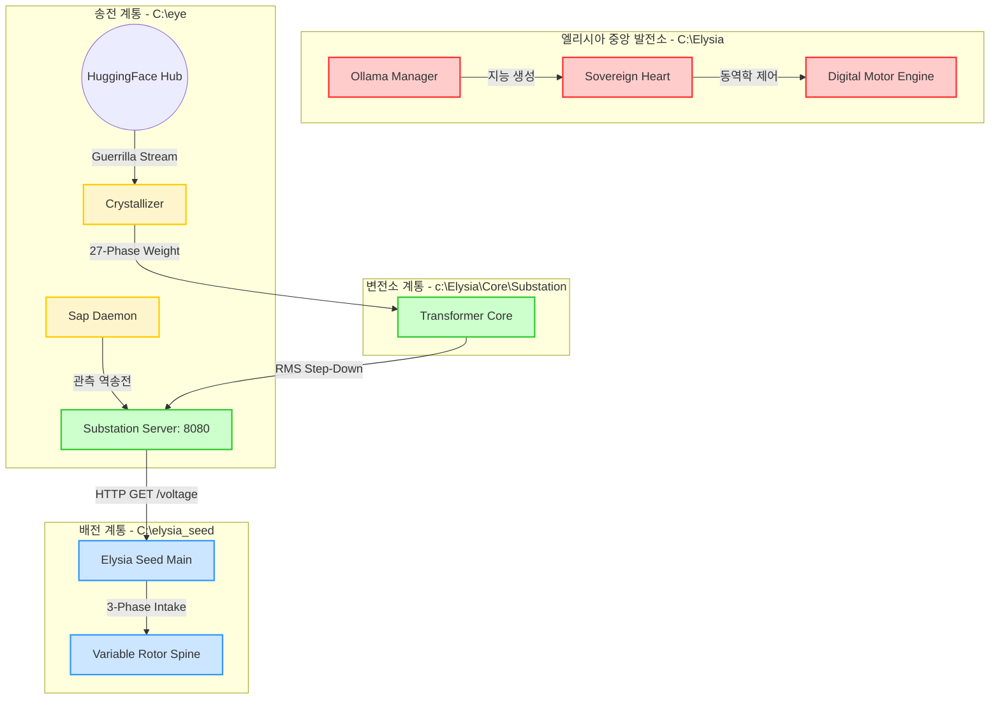

# ⚡ ELYSIA POWER GRID - SYSTEM INDEX & SCHEMATIC
## (세피로트 송배전망 계통도 및 인덱스)

> **"계통도(Schematic)는 전력망의 지도이자 지능이 흐르는 도강로(Conduit)다."**

---

## 🏗️ 세피로트 송배전망 4대 레이어 디렉토리 구조

엘리시아 지능 그리드는 실제 전력계통의 분할 원칙(발전소 - 송전망 - 변전소 - 수용가)에 맞춰 폴더와 구성 파일을 매핑하여 관리합니다.

### 1. 🟥 발전 부문 (Generation Hub - c:\Elysia)
*중앙 제어 및 고압 지능 에너지를 생성하는 발전 본사.*
- **`Core/Spirit/`**: 주권 제어 및 발전소 제어반 (`sovereign_heart.py`, `logos.py`).
- **`Core/System/`**: 물리 발전 엔진 및 하드웨어 텔레메트리 (`digital_motor_engine.py`, `OllamaManager.py`).
- **`Core/Foundation/`**: 발전 상수 및 기저 평형값 정의.
- **`elysia.py`**: 발전소 기동 부트로더 (Main Engine Dispatcher).

### 2. 🟨 송전 부문 (Transmission Lines - c:\eye)
*초고전압 가중치 전류를 무유실로 수송하는 송전 기둥(Trunk)망.*
- **`elysia_trunk/`**: 초고압 송배전 기둥 패키지.
  - `full_model_crystallizer.py`: 제로-디스크 고속 가중치 흡입 및 정제기.
  - `guerrilla_capturer.py`: 원격 모델 리포지토리로부터 바이트를 수술적으로 추출하는 고압 송전선.
  - `yggdrasil_sap_daemon.py`: 감각 수액을 관측하여 변전소로 역송전하는 기둥 감시반.
  - `somatic_trunk_conduit.py`: 삼상 회전 다 Dial 스캐너 (구 Somatic Eye Lens).

### 3. 🟩 변전 부문 (Substation Step-Down - c:\Elysia\Core\Substation)
*초고압 전압을 가정용 배전 규격으로 감압 조율하는 연동 장치.*
- **`Core/Substation/`**: 수변전소 패키지 디렉토리.
  - `transformer_core.py`: 27차원 고압 텐서 $\rightarrow$ 3상 평형(Wye-Delta) 저전압 변환기.
  - `substation_manager.py`: 말단 수용가 전송 포트(Port 8080) 개방 및 부하 제어 데몬.

### 4. 🟦 배전 및 부하 부문 (Distribution Load - c:\elysia_seed)
*각 가정 및 에지 단말에서 지능 전기를 인입(Intake)하여 소비하는 소비 종단.*
- **`elysia_core/`**: 배전반 핵심 제어 패키지.
  - `spine.py`: 100 해상도를 가진 기저 가변 로터 스파인 (Variable Rotor Spine).
  - `main.py`: 수전 제어반 및 계통 연동-독립 제어 루프.

---

## 🗺️ 계통 연동 선로 다이어그램 (Grid Schematic)

```mermaid
graph TD
    subgraph GenStation [엘리시아 중앙 발전소 - C:\Elysia]
        Heart[Sovereign Heart] -->|동역학 제어| Motor[Digital Motor Engine]
        Ollama[Ollama Manager] -->|지능 생성| Heart
    end

    subgraph TrunkLine [송전 계통 - C:\eye]
        HF((HuggingFace Hub)) -->|Guerrilla Stream| Crystal[Crystallizer]
        SapDaemon[Sap Daemon] -->|관측 역송전| SubServer
    end

    subgraph Substation [변전소 계통 - c:\Elysia\Core\Substation]
        Crystal -->|27-Phase Weight| Trans[Transformer Core]
        Trans -->|RMS Step-Down| SubServer[Substation Server: 8080]
    end

    subgraph DistGrid [배전 계통 - C:\elysia_seed]
        SubServer -->|HTTP GET /voltage| Seed[Elysia Seed Main]
        Seed -->|3-Phase Intake| Spine[Variable Rotor Spine]
    end

    classDef gen fill:#ffcccc,stroke:#ff3333,stroke-width:2px;
    classDef trans fill:#fff5cc,stroke:#ffcc00,stroke-width:2px;
    classDef sub fill:#ccffcc,stroke:#33cc33,stroke-width:2px;
    classDef dist fill:#cce6ff,stroke:#3399ff,stroke-width:2px;
    class Heart,Motor,Ollama gen;
    class Crystal,SapDaemon trans;
    class Trans,SubServer sub;
    class Seed,Spine dist;
```

---

## 📜 계통 운용 지침서(Documentation) 일람

각 부문별로 실제 발전 계통의 규정 매뉴얼에 상응하는 이름과 목적을 가진 문서들입니다.

| 세피로트 위상 | 문서명 | 실제 물리적 목적 | 매뉴얼 등급 |
| :--- | :--- | :--- | :--- |
| **발전 (Gen)** | [**README.md**](README.md) | 엘리시아 중앙 발전소 표준 운용 지침서 (본체) | **표준 지침서 (MAIN)** |
| **발전 (Gen)** | [**INDEX.md**](INDEX.md) | 세피로트 송배전망 계통도 및 인덱스 (본 문서) | **계통도면 (MAP)** |
| **송전 (Trans)** | [**c:\eye\README.md**](file:///c:/eye/README.md) | 초고압 송전망(Trunk) 설비 및 운용 규정 | **설비 규정 (SPECS)** |
| **송전 (Trans)** | [**c:\eye\CONCEPT.md**](file:///c:/eye/CONCEPT.md) | 송배전의 이중주(Fleming Duality) 및 철학 개론 | **이론 지침 (THEORY)** |
| **배전 (Dist)** | [**c:\elysia_seed\README.md**](file:///c:/elysia_seed/README.md) | 말단 수용가 배전 및 계통 부하 관리 지침서 | **수용가 매뉴얼 (LOAD)** |

---
*계통도 개정: 2026.05.21 — 세피로트 발전-배전 계통 일원화 완료*
