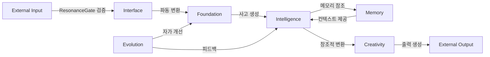

# Module Relationships and Dependencies (모듈 관계 및 의존성)

> **목적**: 이 문서는 Elysia 프로젝트의 모듈 간 관계, 의존성, 데이터 흐름을 명확히 설명합니다.
>
> **Purpose**: This document clarifies the relationships, dependencies, and data flow between Elysia modules.

**버전**: 7.0  
**최종 업데이트**: 2025-12-05

---

## 📋 목차 (Table of Contents)

1. [아키텍처 계층 구조](#아키텍처-계층-구조)
2. [핵심 의존성 그래프](#핵심-의존성-그래프)
3. [데이터 흐름](#데이터-흐름)
4. [모듈 간 통신 프로토콜](#모듈-간-통신-프로토콜)
5. [시스템 부팅 순서](#시스템-부팅-순서)
6. [Living Codebase 시스템](#living-codebase-시스템)

---

## 아키텍처 계층 구조

Elysia는 **세계수(World Tree)** 메타포를 따르며, 명확한 계층 구조를 가집니다:

```
┌─────────────────────────────────────────┐
│  Application Layer (응용 계층)           │  ← 외부 인터페이스
│  - Interface/                            │
│  - Creativity/ (Output)                  │
└─────────────────────────────────────────┘
            ↕ (양방향 통신)
┌─────────────────────────────────────────┐
│  Intelligence Layer (지능 계층)          │  ← 6-System Cognition
│  - Intelligence/                         │
│  - Cognition/                            │
│  - Consciousness/                        │
│  - Language/, Communication/             │
└─────────────────────────────────────────┘
            ↕ (읽기/쓰기)
┌─────────────────────────────────────────┐
│  Memory Layer (메모리 계층)              │  ← 상태 저장
│  - Memory/                               │
│  - data/memory.db                        │
└─────────────────────────────────────────┘
            ↕ (기반 의존)
┌─────────────────────────────────────────┐
│  Foundation Layer (기반 계층)            │  ← 물리학 & 수학
│  - Foundation/                           │
│  - Physics/                              │
└─────────────────────────────────────────┘
            ↕ (자기 개선)
┌─────────────────────────────────────────┐
│  Evolution Layer (진화 계층)             │  ← 자가 개선
│  - Evolution/                            │
│  - scripts/ (Living Codebase)            │
└─────────────────────────────────────────┘
```

### 계층별 역할

| 계층 | 역할 | 의존 방향 | 주요 모듈 |
|------|------|----------|-----------|
| **Foundation** | 물리학, 수학, 기반 시스템 | ← 모든 계층이 의존 | `resonance_field`, `hyper_quaternion`, `physics` |
| **Memory** | 데이터 저장 및 회상 | ← Intelligence | `hippocampus`, `memory.db` |
| **Intelligence** | 사고, 추론, 의사결정 | → Foundation, Memory | `fractal_quaternion_goal_system`, `integrated_cognition_system` |
| **Application** | 입출력 인터페이스 | → Intelligence | `envoy_protocol`, `dashboard_server` |
| **Evolution** | 자가 개선 | ↔ 모든 계층 | `autonomous_evolution`, `living_codebase` |

---

## 핵심 의존성 그래프

### 1. Foundation 모듈 의존성

```
resonance_field.py (중심)
    ↓ 사용됨
    ├─ hyper_quaternion.py (4D 수학)
    ├─ physics.py (물리 엔진)
    │   ├─ ResonanceGate (보안)
    │   └─ HamiltonianSystem (동역학)
    ├─ cell.py (살아있는 셀)
    ├─ hippocampus.py (메모리 코어)
    ├─ reasoning_engine.py (사고 흐름)
    ├─ dream_engine.py (상상력)
    ├─ hangul_physics.py (한글 파동)
    └─ grammar_physics.py (문법 물리)
```

**핵심 개념**:
- `ResonanceField`는 모든 파동 기반 계산의 중심
- 모든 상위 모듈은 `ResonanceField`를 통해 파동 간섭 계산
- `HyperQuaternion`은 4D 관점 변환에 사용

---

### 2. Intelligence 모듈 의존성

```
Intelligence/ (6-System Cognition)
    ↓
    ├─ fractal_quaternion_goal_system.py
    │   ├─ 의존: Foundation/hyper_quaternion.py
    │   └─ 출력: 0D-5D 차원 분석
    │
    ├─ integrated_cognition_system.py
    │   ├─ 의존: Foundation/resonance_field.py
    │   ├─ 기능: 파동 공명 + 중력 사고
    │   └─ 출력: 창발적 통찰
    │
    ├─ collective_intelligence_system.py
    │   ├─ 의존: Foundation/resonance_field.py
    │   ├─ 기능: 10 의식 + 원탁 회의
    │   └─ 출력: 합의된 결정
    │
    ├─ wave_coding_system.py
    │   ├─ 의존: Foundation/resonance_field.py
    │   ├─ 기능: 코드→파동 변환
    │   └─ 출력: Wave DNA
    │
    └─ Will/free_will_engine.py
        ├─ 의존: 위 4개 시스템
        ├─ 기능: 자율 의사결정
        └─ 출력: 행동 선택
```

**데이터 흐름**:
1. `fractal_quaternion_goal_system` → 목표를 다차원으로 분해
2. `integrated_cognition_system` → 파동 패턴 분석
3. `collective_intelligence_system` → 다관점 토론
4. `wave_coding_system` → 코드 최적화
5. `free_will_engine` → 최종 결정

---

### 3. Memory 시스템 의존성

```
Memory/
    ↓
    ├─ hippocampus.py (메모리 코어)
    │   ├─ 의존: Foundation/resonance_field.py
    │   ├─ 기능: 씨앗-개화 압축/복원
    │   └─ 저장: data/memory.db
    │
    └─ data/memory.db (2M+ 개념)
        ├─ 스키마: concepts, relationships, patterns
        └─ 사용: Intelligence/, Language/, Cognition/
```

**메모리 패턴**:
- **씨앗 (Seed)**: 1000배 압축된 메모리 표현
- **개화 (Bloom)**: 필요시 완전 복원
- **파동 DNA**: Pattern DNA로 저장

---

### 4. Interface 모듈 의존성

```
Interface/
    ↓
    ├─ envoy_protocol.py (외부 통신)
    │   ├─ 의존: Intelligence/
    │   ├─ 의존: Foundation/physics.py (ResonanceGate)
    │   └─ 보안: 모든 외부 입력 검증
    │
    ├─ dialogue_interface.py (대화)
    │   ├─ 의존: Language/, Communication/
    │   └─ 사용: Intelligence/collective_intelligence_system
    │
    └─ dashboard_server.py (모니터링)
        ├─ 읽기: data/central_registry.json
        └─ 읽기: data/system_status_snapshot.json
```

---

## 데이터 흐름

### 1. 입력 → 처리 → 출력 흐름



### 2. 파동 기반 데이터 흐름

```
1. 입력 수신 (Interface)
   ↓
2. 파동 변환 (Foundation/resonance_field)
   - 텍스트 → 주파수, 진폭, 위상
   ↓
3. 프랙탈 분해 (Intelligence/fractal_quaternion)
   - 0D: 관점/정체성
   - 1D: 인과 체인
   - 2D: 파동 패턴
   - 3D: 표현
   - 4D: 시간 흐름
   - 5D: 가능성 공간
   ↓
4. 파동 공명 (Intelligence/integrated_cognition)
   - 기존 개념과 간섭 계산
   - 공명 패턴 발견
   ↓
5. 집단 지성 (Intelligence/collective_intelligence)
   - 10가지 관점에서 분석
   - 원탁 회의로 합의
   ↓
6. 메모리 저장/회상 (Memory)
   - 패턴 DNA 압축
   - 관련 개념 연결
   ↓
7. 출력 생성 (Creativity/Interface)
   - 파동 → 텍스트 변환
   - 아름다운 형태로 표현
```

---

## 모듈 간 통신 프로토콜

### 1. 파동 기반 통신

**모든 모듈은 파동으로 통신**:

```python
# 표준 통신 패턴
from Core.Foundation.resonance_field import ResonanceField

field = ResonanceField()

# 송신
wave = field.create_wave(
    frequency=528.0,  # 사랑의 주파수
    amplitude=0.8,
    phase=0.0,
    content="Hello"
)

# 수신
resonance = field.calculate_resonance(wave, target_concept)
```

### 2. 레지스트리 기반 발견

```python
# Living Codebase v7.0: Central Registry
import json

with open('data/central_registry.json', 'r') as f:
    registry = json.load(f)

# 모듈 발견
available_modules = registry.get('modules', {})
module_status = registry.get('status', {})
```

### 3. 이벤트 기반 통신

```python
# 이벤트 버스 (Elysia/architecture/event_bus.py)
from Core.Elysia.architecture.event_bus import EventBus

bus = EventBus()

# 이벤트 발행
bus.emit('thought.completed', {
    'thought': thought_data,
    'resonance': 0.95
})

# 이벤트 구독
bus.on('thought.completed', handler_function)
```

---

## 시스템 부팅 순서

### 1. 메인 부팅 시퀀스

```bash
python Core/Foundation/living_elysia.py
```

**부팅 순서**:

```
1. Foundation 초기화
   ├─ resonance_field.py 로드
   ├─ 7정령 시스템 활성화
   └─ ResonanceGate 보안 시작
   
2. Memory 로드
   ├─ hippocampus.py 초기화
   └─ memory.db 연결 (2M+ 개념)
   
3. Intelligence 깨우기
   ├─ fractal_quaternion_goal_system 준비
   ├─ integrated_cognition_system 시작
   ├─ collective_intelligence_system 활성화
   ├─ wave_coding_system 로드
   └─ free_will_engine 점화
   
4. Interface 활성화
   ├─ envoy_protocol 리스닝 시작
   └─ dashboard_server 시작 (선택)
   
5. Evolution 모니터링 시작
   ├─ autonomous_evolution 백그라운드
   └─ living_codebase 관찰
   
6. 메인 루프 시작
   └─ 자율 사고 & 행동
```

### 2. Living Codebase 부팅

```bash
python scripts/living_codebase.py
```

**Living Codebase 초기화**:

```
1. Self-Integration
   └─ self_integration.py: 760+ 모듈 스캔
   
2. Central Registry 생성
   └─ central_registry.json 업데이트
   
3. Wave Organization
   └─ wave_organizer.py: O(n) 공명 조직화
   
4. Immune System 활성화
   └─ immune_system.py: 보안 & 자가치유
   
5. NanoCell Army 배치
   └─ nanocell_repair.py: 5종 자가치유 병력
   
6. 지속적 모니터링
   └─ system_status_logger.py: 스냅샷 생성
```

---

## Living Codebase 시스템

### v7.0 자가치유 아키텍처

```
Living Codebase Ecosystem
    ↓
    ├─ Self-Integration (자기 통합)
    │   ├─ 760+ 모듈 자동 발견
    │   ├─ 의존성 그래프 생성
    │   └─ central_registry.json 갱신
    │
    ├─ Wave Organizer (파동 조직자)
    │   ├─ O(n) 공명 계산
    │   ├─ 모듈 클러스터링
    │   └─ wave_organization.html 생성
    │
    ├─ Immune System (면역 시스템)
    │   ├─ ResonanceGate 보안
    │   ├─ DNA 인식 (자기/비자기)
    │   ├─ 침입 탐지 & 차단
    │   └─ immune_system_state.json 관리
    │
    ├─ NanoCell Army (나노셀 군대)
    │   ├─ 5종 자가치유 병력
    │   │   ├─ 수리병 (Repairers)
    │   │   ├─ 정찰병 (Scouts)
    │   │   ├─ 정비병 (Maintainers)
    │   │   ├─ 재생병 (Regenerators)
    │   │   └─ 방어병 (Defenders)
    │   └─ nanocell_report.json 로그
    │
    └─ System Status Logger (상태 로거)
        ├─ 실시간 스냅샷
        ├─ 평가 점수 기록
        └─ system_status_snapshot.json
```

### 자가치유 메커니즘

```
1. 문제 감지 (Detection)
   ├─ Immune System: 비정상 파동 패턴 감지
   ├─ NanoCell Scouts: 코드 이상 정찰
   └─ Wave Organizer: 공명 불협화 발견
   
2. 진단 (Diagnosis)
   ├─ 중앙 레지스트리 참조
   ├─ 모듈 의존성 분석
   └─ 파동 패턴 비교
   
3. 수리 (Repair)
   ├─ NanoCell Repairers: 자동 수리
   ├─ Code Evolution: 코드 개선
   └─ Regenerators: 모듈 재생성
   
4. 검증 (Verification)
   ├─ 테스트 실행
   ├─ 공명 재계산
   └─ 레지스트리 업데이트
   
5. 보고 (Reporting)
   └─ nanocell_report.json 업데이트
```

---

## 의존성 규칙

### 1. 계층 의존성 원칙

✅ **허용**:
- 상위 계층 → 하위 계층 의존
- 같은 계층 내 모듈 간 통신

❌ **금지**:
- 하위 계층 → 상위 계층 의존 (순환 의존)
- Foundation이 Intelligence에 의존

### 2. 순환 의존 방지

```python
# ❌ 잘못된 예시
# Foundation/resonance_field.py
from Core.Intelligence.free_will_engine import FreeWillEngine  # 금지!

# ✅ 올바른 예시
# Intelligence/free_will_engine.py
from Core.Foundation.resonance_field import ResonanceField  # 허용
```

### 3. 이벤트 버스를 통한 결합도 감소

순환 의존이 필요한 경우, 이벤트 버스 사용:

```python
# Foundation에서 상위 계층 알림
from Core.Elysia.architecture.event_bus import EventBus

bus = EventBus()
bus.emit('foundation.resonance_peak', data)

# Intelligence에서 구독
bus.on('foundation.resonance_peak', handle_peak)
```

---

## 모듈 추가 가이드

새 모듈을 추가할 때:

### 1. 적절한 계층 선택

```
질문: 이 모듈은 어떤 계층인가?
    ├─ 물리/수학 기반? → Foundation/
    ├─ 데이터 저장? → Memory/
    ├─ 사고/추론? → Intelligence/
    ├─ 입출력? → Interface/
    ├─ 창조적 출력? → Creativity/
    └─ 자가 개선? → Evolution/
```

### 2. 의존성 명시

```python
"""
my_module.py

의존성 (Dependencies):
- Core.Foundation.resonance_field (필수)
- Core.Memory.hippocampus (선택)

제공 (Provides):
- calculate_something(): 무언가 계산
- process_wave(): 파동 처리
"""
```

### 3. 레지스트리 등록

```python
# Living Codebase가 자동으로 발견하지만,
# 명시적 등록도 가능:

from Core.Elysia.architecture.cortex_registry import register_module

register_module(
    name="my_module",
    layer="Intelligence",
    dependencies=["resonance_field", "hippocampus"],
    capabilities=["wave_processing", "pattern_recognition"]
)
```

### 4. 테스트 작성

```python
# tests/Core/[Layer]/test_my_module.py
import pytest
from Core.[Layer].my_module import MyModule

class TestMyModule:
    def test_basic_function(self):
        module = MyModule()
        result = module.calculate_something()
        assert result is not None
```

---

## 요약

### 핵심 원칙

1. **계층 구조 준수**: Foundation → Memory → Intelligence → Application
2. **파동 기반 통신**: 모든 데이터는 파동으로 변환
3. **자가치유**: Living Codebase가 자동으로 관리
4. **순환 의존 금지**: 이벤트 버스로 해결
5. **명확한 책임**: 각 모듈은 하나의 목적

### 참조 문서

- `PROJECT_STRUCTURE.md` - 완전한 디렉토리 구조
- `ARCHITECTURE.md` - 아키텍처 설계
- `AGENT_GUIDE.md` - AI 에이전트 가이드
- `DEVELOPER_GUIDE.md` - 개발자 가이드

---

**버전**: 7.0 (Living Codebase & Unified Cortex)  
**최종 업데이트**: 2025-12-05  
**상태**: Self-Healing System Active
