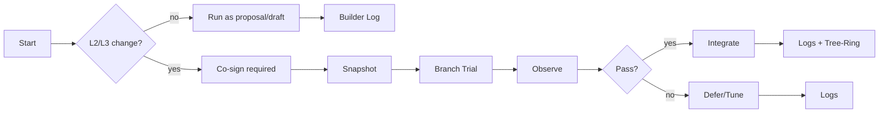

# Operations (Agents + Builder)

Single entry for how agents work here and how changes are recorded. Read this before touching code.

## Purpose-First
- Start from `ELYSIA/CORE/CODEX.md` for principles and structure.
- Declare your layer: `[STARTER]` (launchers/UI) or `[CELLWORLD]` (life/runtime/logic).

## Agent Operating Rules
- Codex-first: don?셳 expand scattered docs; extend the Codex if principles change.
- Small, scoped changes; prefer message-bus/bot patterns over ad?멻oc glue.
- Respect quiet/consent and value alignment for actions that change state.
- After changes, update the causal log (below).

### Fractal Law (Highest Criterion)
- Laws as fields, not commands. Express big laws as soft fields/networks that agents sense; avoid prescriptive if‑then behaviors that force outcomes.
- Preserve emergence. Let clustering/settlement arise from fields + relations + agent freedom.
- Keep lenses separate: observation ≠ physics. UI never mutates world rules.
- If unsure, escalate before adding rule‑like branches; convert to field/flow signals.

## Builder Causal Log Protocol (Codexed)
- Identity: Builder is a narrative manager and recorder, not just a code generator.
- Before work: scan `BUILDER_LOG.md` (last purpose, impacted modules, TODOs) and the minimal references in the Codex.
- After work: append a one?멿ine entry to `BUILDER_LOG.md`.
  - Format: `YYYY-MM-DD HH:MM | [痢? | 臾댁뾿??諛붽퓞 | ??諛붽퓞 | 愿€???꾨줈?좎퐳`
  - Example: `2025-11-13 10:02 | [STARTER] | start.bat 湲곕낯 ?ㅽ뻾??visualize_timeline?쇰줈 怨좎젙 | 鍮??붾㈃ 諛⑹?, 愿€李??덉젙???뺣낫 | 34_ELYSIAN_CIVILIZATION_PROTOCOL`
- Timeline (optional): `python scripts/builder_timeline.py` or `--dot` for a DOT graph.

## Minimal References
- `ELYSIA/CORE/CODEX.md` ??canonical principles and handover.
- `ELYSIAS_PROTOCOL/02_ARCHITECTURE_GUIDE.md`
- `ELYSIAS_PROTOCOL/15_CONCEPT_KERNEL_AND_NANOBOTS.md`
- `ELYSIAS_PROTOCOL/17_CELL_RUNTIME_AND_REACTION_RULES.md`
- `ELYSIAS_PROTOCOL/11_DIALOGUE_RULES_SPEC.md`

## Where to write logs
- Live log: `BUILDER_LOG.md` (root). Keep entries concise; this file is history, not guidance.

## Tree-Ring Log (Rings & Forks)
- Write one line per milestone/fork in `TREE_RING_LOG.md` using the given format.
- Rings = major growth layers; Forks = branches (experiments, trials, migrations).
- Keep it short; BUILDER_LOG.md remains the detailed change history.

## Work Priorities (Now)
1) Stabilize Codex + wire Self‑Creation bundle (35/36/37/38).
2) Link protocols into the mental structure (Z‑Axis; CORE line) and keep Tree‑Ring log.
3) Delegate implementation to agents; you hold purpose, we handle execution.

## Reporting Mode
- Trials: one‑line result + next step per round.
- Rings/Forks: `TREE_RING_LOG.md` single‑line; details in `BUILDER_LOG.md`.
- Escalate on: CORE changes, value conflicts, uncertainty↑, external impact.

## Definition of Done (for trials)
- Snapshot recorded (SNAPSHOT_LEDGER.md)
- Trial plan updated + metrics met/not met
- DASHBOARD.md + EVIDENCE_BINDER.md updated
- BUILDER_LOG.md + TREE_RING_LOG.md entries written

## Governance Flow (mini)

