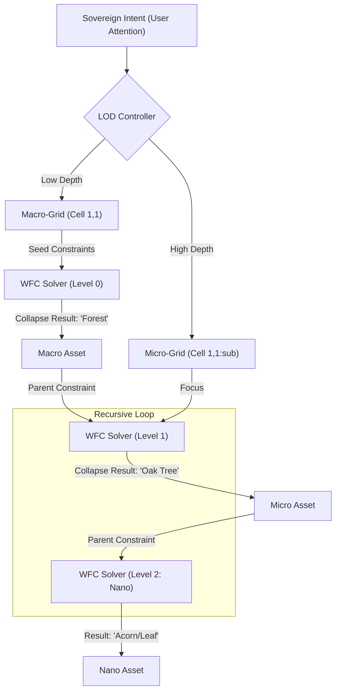

# RECURSIVE COLLAPSE ENGINE (R-WFC) SPECIFICATION

> **"The universe is a fractal where the observer's attention is the light that collapses probability into detail."**

## 1. Overview

The **Recursive Collapse Engine (R-WFC)** is the architectural bridge between the **Holographic Wave Field** (Probability Space) and the **Manifested World** (Discrete Reality). It uses nested constraint satisfaction to enable infinite "Zoom" capability with zero persistent storage.

## 2. The Unified Logic: WFC is Spatial Attention

| Attribute | Attention (Semantic) | R-WFC (Spatial) | The Elysian Synthesis |
| :--- | :--- | :--- | :--- |
| **Input** | Query (Q) | Target Cell | "What am I?" |
| **Context** | Key (K) | Neighbors | "What is nearby?" |
| **Options** | Value (V) | Tile Palette | "What can I be?" |
| **Method** | Softmax/Weight | Constraint/Entropy | The Probabilistic Flow |
| **Outcome** | Token Prediction | **Collapse** | **Crystallized Reality** |

## 3. Architecture Diagram

## 3. Core Principles

### 3.1 Lazy Evaluation (The Observer Effect)

- **Data Persistence**: Only the **Seeds** (initial principles) are stored permanently.
- **Dynamic Creation**: The actual world (tiles, objects, text) is generated on-the-fly when the camera/mind moves within range.
- **Garbage Collection**: Once attention shifts away, the micro-collapsed data is returned to the wave state, preserving RAM.

### 3.2 Parent Context Preservation

- Every sub-WFC grid must honor the constraints of its parent cell.
- Example: If the Parent is "Eternal Winter", the sub-grid *cannot* generate a tropical desert regardless of its local rules.

### 3.3 Conceptual LOD (The "Why" Zoom)

- Applying R-WFC to string/semantic data.
- **Level 0**: Summary of a topic.
- **Level 1**: Detailed explanation.
- **Level 2**: Academic/Technical source material.
- **Level 3**: The raw math/physics of the concept.

## 4. Implementation Strategy (Phase 110)

1. **Core Solver**: Upgrade existing WFC logic to support recursive depth parameters.
2. **Focus Tracking**: Initialize a "Heatmap" of User attention to drive the recursive depth.
3. **Asset Bridge**: Connect R-WFC results to the **Holographic Manifestor** for 3D/Visual output.

---
> [!TIP]
> **R-WFC** effectively turns Elysia from a "Map Maker" into a **"Reality Modulator."**
