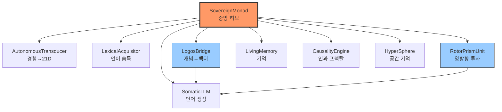

# 🕸️ STRUCTURAL GRAPH: Agent-Readable Connection Map

> **이 문서의 목적**: 에이전트가 세션 시작 시 읽어 전체 시스템 연결을 즉시 파악하기 위함.
> **최종 스캔**: 2026-02-03

---

## 🌳 핵심 허브 (Core Hubs)



---

## ⚠️ 미연결 고아 모듈 (Orphaned Modules)

| 모듈 | 경로 | 상태 |
|------|------|------|
| **CognitiveTerrain** | `L6_Structure/M1_Merkaba/` | ❌ SovereignMonad와 미연결 |
| **MentalTerrain** | `L5_Mental/Reasoning_Core/Topography/` | ❌ LogosBridge와 미연결 |
| **AkashicField** | `L1_Foundation/Foundation/` | ❌ torch 의존, 메인 루프 미사용 |

---

## 🔗 핵심 연결 관계

### SovereignMonad (중앙 허브)

```
사용하는 모듈:
├── AutonomousTransducer (경험→21D 변환)
├── LexicalAcquisitor (언어 습득)
├── LogosBridge (개념↔벡터 매핑)
├── RotorPrismUnit (project/perceive 양방향)
├── SomaticLLM (언어 출력)
├── LivingMemory (기억)
├── CausalityEngine (인과)
└── HyperSphere (공간 기억)
```

### LogosBridge (언어-벡터 브릿지)

```
사용되는 곳:
├── SomaticLLM (개념 식별)
├── SovereignMonad (text resonance)
├── verify_alchemical_bridge
└── verify_thinking_3

누락된 연결:
├── ❌ CognitiveTerrain (학습→지형 조각)
└── ❌ MentalTerrain (개념 위상)
```

### RotorPrismUnit (양방향 프리즘)

```
project() ← 의도 → 현실 (출력)
perceive() ← 현실 → 의도 (입력)

연결됨: SovereignMonad, SomaticLLM
```

---

## 📊 의존성 통계

| 기반 모듈 | 참조 횟수 | 역할 |
|-----------|-----------|------|
| `causality` | 200+ | 인과 프랙탈 엔진 (보편적 의존) |
| `hypersphere` | 100+ | 공간 기억/공명 |
| `trinary_logic` | 15+ | 삼진법 핵심 |
| `sovereign_monad` | 20+ | 중앙 통합 허브 |
| `logos_bridge` | 10+ | 개념 기억 |

---

## 🚨 통합 우선순위

1. **CognitiveTerrain ↔ LogosBridge**
   - `learn_concept()` 시 JSON 대신 지형 조각

2. **MentalTerrain ↔ SovereignMonad**
   - `breath_cycle()` 시 생각 궤적 시뮬레이션

3. **AkashicField → SovereignMath 전환**
   - torch 의존 제거, Naked Sovereignty 달성
