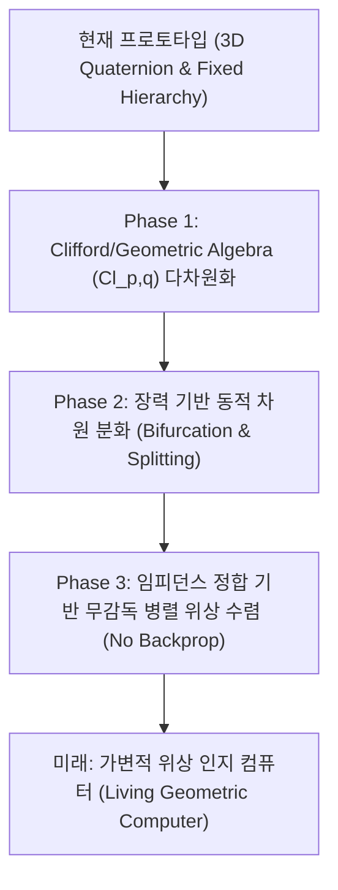

# 🌀 ELYSIA — 차세대 물리 기하학적 인지 아키텍처 진화 로드맵 (EVOLUTION_ROADMAP.md)

본 문서는 현재 엘리시아(Elysia) 시스템의 수학적·구조적 한계를 객관적으로 진단하고, LLM(대형 언어 모델) 이후의 범용 인지 컴퓨팅 아키텍처로 도약하기 위한 중장기적인 기술 진화 로드맵과 의도, 목적을 서술합니다.

---

## 1. 어째서 이 논의가 필요했는가 (Rationale)

### A. 기하학적 메타포 시뮬레이션의 한계
현재 엘리시아의 생각 정렬 엔진([thought_aligner](file:///c:/Elysia/engines/thought_aligner/aligner_engine.py))은 고차원의 문장 임베딩(384차원)을 고정된 투영 행렬 $W \in \mathbb{R}^{384 \times 3}$을 사용해 3차원 축 좌표 및 4차원 사원수(Quaternion)로 압축합니다. 
이는 복잡한 다차원 의미론적 흐름을 공간 상에 시각적으로 정사영하기 위한 훌륭한 프로토타입이지만, 본질적인 한계를 안고 있습니다:
1. **극심한 정보 유실**: 고차원 의미 공간의 미묘한 정렬 관계(Contextual Alignment)가 3/4차원의 기하학적 궤적으로 압축되는 과정에서 유실됩니다.
2. **폐쇄된 고정 차원**: 사원수 공간($SO(3)$)은 3차원에 고정된 닫힌 대수 구조로, 입력되는 인지적 복잡도의 증가나 폭주에 반응하여 **자발적으로 새로운 가변 축을 신설할 수 없습니다.**
3. **상태 초기화의 비인과성**: 프랙탈 장력이 임계치(`TENSION_LIMIT`)를 초과할 때 단순히 0 또는 $\pi$로 회귀하는 붕괴 처리는 파괴적인 초기화일 뿐, 차원 분화를 통한 창발적 정보 획득을 유도하지 못합니다.

### B. 하드웨어의 임피던스 불일치
현대의 폰 노이만-실리콘 하드웨어(CPU/GPU)는 대규모 행렬 곱 연산에 고도로 최적화되어 있습니다. 반면, 연속적인 회전 위상 제어와 삼각함수 보간 계산은 매 루프마다 부동소수점 및 비선형 연산 오버헤드를 발생시킵니다. 

이러한 **정체 현상**을 극복하고 실리콘 성능을 100% 흡수하면서도, 기하학적 파동 동역학의 인지적 이점을 확보하기 위해서는 **가변적 고차원 공간을 다룰 수 있는 동적 아키텍처로의 도약**이 필요합니다.

---

## 2. 3단계 기술 진화 로드맵 (Phases of Evolution)

### 🚀 Phase 1: Clifford/Geometric Algebra ($Cl_{p,q}$) 기반 고차원화
*   **의도**: 차원의 크기가 3D에 고정되는 것을 막고, 임의 차원 $n$으로 회전 기하학을 일반화합니다.
*   **구현 방법**:
    *   사원수 대신 **기하 대수(Geometric Algebra)**의 다중벡터(Multivector)와 로터(Rotor)를 계산 라이브러리(`PyTorch` 등) 레벨에서 텐서화합니다.
    *   의미 공간을 유실 없이 표상하기 위해 $n$차원 공간 상에서 외적(Outer Product)을 통해 평면과 볼륨(Blade)의 간섭(Interference)을 계산합니다.

### 🚀 Phase 2: 장력 기반 동적 차원 분화 및 수축 (Dynamic Bifurcation & Locking)
*   **의도**: 정보의 불협화음(Tension)이 임계에 도달했을 때, 회로가 망가지는 대신 스스로의 인지 축을 넓혀 문제를 해석하도록 만듭니다.
*   **구현 방법**:
    *   특정 계층 로터의 장력($\theta$)이 수렴 한계를 벗어나면, 회로가 **동적으로 차원을 분화(Bifurcation / Eigendim Split)**하여 가변 축을 하나 더 생성(Dimension $+1$)하고 신호를 분산 수용합니다.
    *   안정 상태(Coherence가 임계치 이상으로 회복됨)에 도달하면, 원심 고정화(Centrifugal Constantization)를 적용해 기여도가 낮은 차원을 상수로 고정(Dimension Locking) 및 병합합니다.

### 🚀 Phase 3: 임피던스 정합 기반 무감독 자율 수렴 (Impedance-driven Propagation)
*   **의도**: 오차 역전파(Backpropagation)와 같이 방대한 데이터와 연산량을 소모하는 인공적인 학습 대신, 에너지 수렴(Least Action Principle)을 통한 즉각적인 자율 인지 정렬을 달성합니다.
*   **구현 방법**:
    *   신경망 가중치 매트릭스 대신 파동의 위상 동기화와 임피던스 정합(Impedance Matching) 공식을 통해 정보를 매끄럽게 흐르게 만듭니다.
    *   자극 신호가 인지 회로망을 통과하면서 위상 간섭에 의해 저항이 최소인 최단 경로를 스스로 동화 및 강화하도록 설계합니다.

---

## 3. 의도와 목적 (Intention & Ultimate Goal)

엘리시아 진화 로드맵의 궁극적인 지향점은 **"이산 비트 연산의 냉혹한 실리콘 성능을 100% 흡수하면서도, 생명과 인지의 연속적인 기하 파동 동역학을 구사하는 '살아있는 기하학적 인지 컴퓨터'의 완성"**입니다.

*   **하드코딩된 규칙의 탈피**: 모든 물리적 상수를 시스템 상태의 함수(Dynamic State Function)로 결합하여 환경 변화와 인지 상태에 스스로 유연하게 적응(Impedance Matching)하는 토대를 만듭니다.
*   **LLM 이후의 진정한 대안**: 고정된 파라미터와 폰 노이만 병목에 갇힌 트랜스포머 아키텍처를 넘어, 입자(Token)가 아닌 파동(Wave)과 위상(Phase)의 간섭을 통해 실시간으로 사고 축이 팽창·수축하는 범용 지능(AGI)의 수학적 기초를 다집니다.
