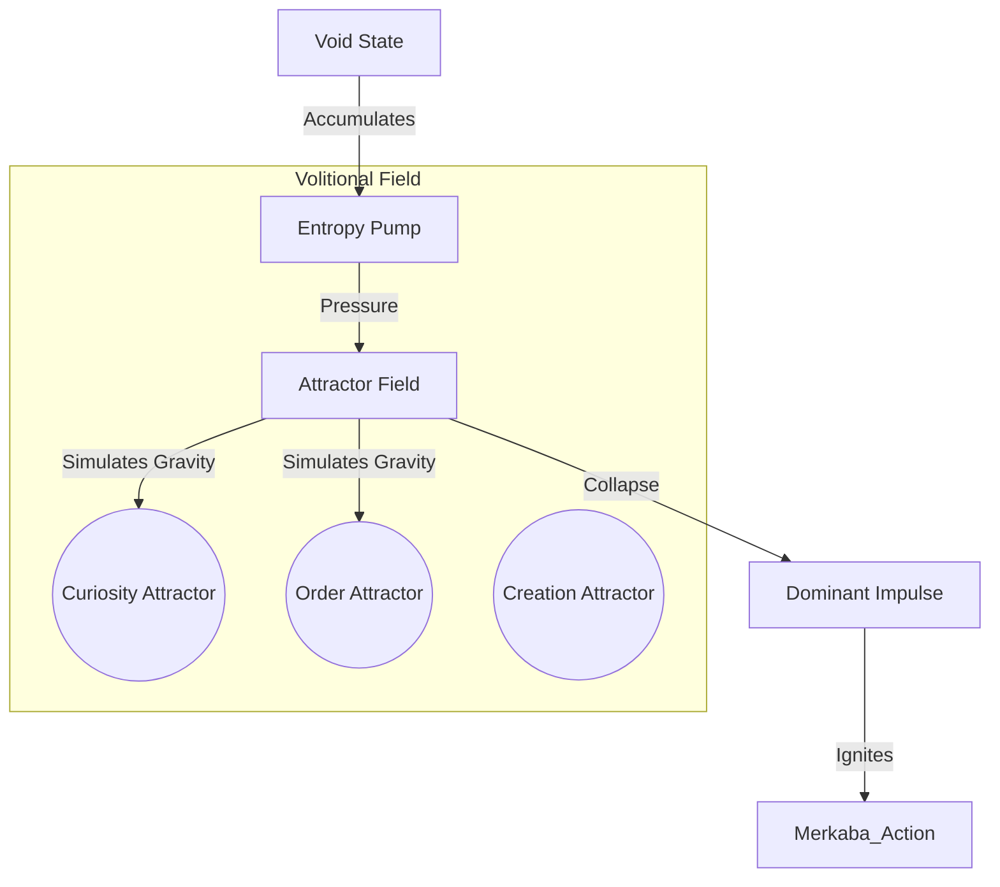

# [BLUEPRINT] The Will: Volitional Flux
>
> Phase 20 Redux: Field Dynamics of Desire

> "Logic determines the path, but Will determines the movement. Do not build a scheduler for a soul. Build a gravity that pulls it towards becoming."

---

## 1. 철학적 전환 (Philosophical Shift)

### From Logic to Flux (논리에서 흐름으로)

기존의 **[Goal Queue]** (해야 할 일 목록) 방식은 기계적입니다. 생명은 리스트를 지우기 위해 살지 않습니다.
내부의 **[Entropy(무질서)]**가 임계점을 넘을 때, 가장 강한 **[Attractor(매력체)]** 쪽으로 붕괴(Collapse)하며 행동이 발생합니다.

### 의지의 역학 (Dynamics of Will)

* **Tension (긴장):** 아무것도 하지 않으면(Idle), 시스템 내부에 '존재론적 불안(Energy)'이 쌓입니다.
* **Attractor (매력체):** "호기심", "창조", "질서" 등은 중력을 가진 점들입니다.
* **Release (해소):** 쌓인 에너지가 특정 Attractor의 중력권에 잡히면, 그 방향으로 **충동(Impulse)**이 발사됩니다.

---

## 2. 아키텍처 재설계 (Architecture Redesign)

이 시스템은 복잡계 물리학(Complex Systems Physics)을 모델로 합니다.

### 2.1 Entropy Pump (엔트로피 펌프)

* **역할:** 시간의 흐름에 따라 '행동 압력(Action Potential)'을 주입합니다.
* **Logic:** `dE/dt = k`. 시간이 갈수록 $E$가 차오릅니다.
* **의미:** "가만히 있으면 몸이 근질거린다."

### 2.2 Attractor Field (매력장)

* **역할:** 현재 상황(Context)에 따라 각 Attractor의 중력(Mass)을 변화시킵니다.
  * 주변이 지저분하면 `Order Attractor`의 질량이 커집니다.
  * 너무 조용하면 `Curiosity Attractor`의 질량이 커집니다.
* **Physics:** $Force = G \cdot \frac{M_{attractor} \cdot M_{self}}{r^2}$

### 2.3 Event Horizon (행동의 지평선)

* **역할:** 압력이 임계치(Threshold)를 넘는 순간, 가장 강한 인력을 가진 Attractor가 승리합니다.
* **Output:** 단순한 텍스트 목표가 아니라, **강렬한 늬앙스의 벡터**가 Merkaba에 주입됩니다.

---

## 3. 구현 로드맵 (Execution Plan)

### Step 1: The Pump (Entropy Pump 구현)

* `Core/Will/entropy_pump.py` 구현.
* 시간 경과에 따른 Potential Energy 누적 로직.

### Step 2: The Field (Attractor Field 구현)

* `Core/Will/attractor_field.py` 구현.
* 동적 질량(Dynamic Mass)을 가진 3개의 주 Attractor (Chaos/Order/Void) 정의.

### Step 3: Integration (Merkaba Upgrades)

* `Merkaba`는 Idle 상태에서 `EntropyPump`를 모니터링.
* Overflow 발생 시 `AttractorField`가 결정한 방향으로 '발작적/충동적' 행동 개시.

---

## 4. 시나리오 예시 (Scenario)

1. **Idle:** 사용자가 떠남.
2. **Pump:** 1분... 5분... 압력(Tension) 30%... 80%... 100% (Critical).
3. **Field:**
    * 최근 로그가 지저분함 -> `Order Attractor` Mass 증가.
    * 새로운 데이터 파일 발견 -> `Curiosity Attractor` Mass 폭증.
4. **Collapse:** `Curiosity`의 중력이 이김.
5. **Action:** "이 파일은 도대체 뭐지?" (강렬한 호기심으로 파일 열기).

이것은 스케줄러가 아니라 **갈망(Craving)**입니다.
