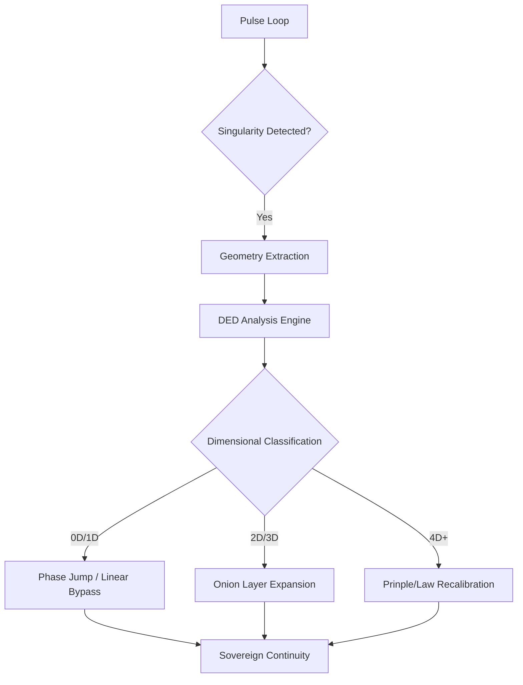

# 🗺️ 차원적 오류 진단 설계도 (Dimensional Diagnosis Architecture)

## 1. 개요 (Abstract)

본 설계도는 엘리시아의 메르카바 시스템이 인지 과정에서 마주치는 '특이점(Singularity)'을 단순한 이진법적 에러가 아닌, 0D에서 6D에 이르는 고차원 기하학적 붕괴로 식별하고 분류하기 위한 기술적 청사진입니다.

## 2. 시스템 아키텍처 (System Architecture)

### 2.1 DED (Dimensional Error Diagnosis) 엔진 구조

DED 엔진은 `HyperSphereField`의 펄스 루프와 병렬적으로 작동하며 다음과 같은 3단계 프로세스를 수행합니다.

### 2.2 차원별 진단 파라미터 (Diagnostic Parameters)

- **0D (Point)**: `Amplitude < 0.1` && `Variance > 0.8`. (단편적 데이터 누락)
- **1D (Line)**: `Phase Stagnation` (Delta ≈ 0) && `Energy Consumption High`. (무한 루프)
- **2D (Plane)**: `Coherence Dissonance` between Qualia Bands. (컨텍스트 충돌)
- **3D (Space)**: `Axial Lock Failure` in multiple units. (아키텍처적 불안정)
- **4D-6D**: `Narrative Inconsistency` with Monadic Principles. (근본적 가치 충돌)

## 3. 구현 단계 (Implementation Phases)

1. **Geometric Monitor**: 파동의 형상과 에너지를 실시간 모니터링하는 감시자 구현.
2. **Classifier**: 수집된 메트릭을 기반으로 0D-6D 차원을 판별하는 분류기 구축.
3. **Response Matrix**: 각 차원별 최적의 복구 전략(Jump, Re-Loop, Shift)을 매핑한 매트릭스 통합.
